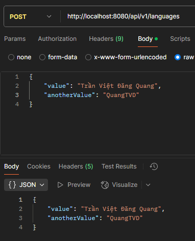

# Module-oriented architecture for Java RestAPI
(This is my personal project, meaning it does not belong to my old company or my current University)
## About the project
- **Why I choose to research about this?**
  - I have experienced with a lot of RestAPI project as like as ASP.NET Clean Architecture, Java Springboot Clean Architecture, NodeJS Express,... and some projects don't event be API such as IVI project that I work on at my old company. And I found that the more features you add, the more the complexity of the project is. So I'm thinking about divide the project to small parts with their relations for the simplity.
  - Moreover, I have ADHD syndrom, so the big projects may cause some problems to me, as when I want to fix a bug in a big project, I have to spend half a day to know where the bug is when normal people just need to spend 2-3 hours, or sometimes, I have to put a lot of log or delete a lot of bug just to find where I try to find.
- **What is the idea?**
  - As my experient, a module will use from 1 to 3 or even 10 tables in database. So I want to devide a big project to small modules. And I think that will be much easier to use, to maintain as well as to fix bugs. This project is Springboot like, and is build on Java Servlet framework.
- **What does it bring?**
  - This architecture is very easy to:
    - Implement
    - Use
    - Maintain
    - Fixbug
- **Why using Java Servlet instead of Springboot or others?**
  - Springboot and Java Servlet is all Java frameworks I know, and using Springboot to create somethings like Springboot may be the most funniest joke in the world.
## How to use
### Main server setup
- Setup run file (.cmd file for window, .sh file for linux), change the path to tomcat folder
  - CMD file
  ```cmd
  REM Set the Tomcat folder path
  set CATALINA_HOME=D:\apache-tomcat-11.0.5
  ```
  - SH file
  ```sh
  # Set the Tomcat folder path
  CATALINA_HOME="/apache-tomcat-11.0.5"
  ```
- Setup config file
  - Setup server, api-prefix is the prefix of all of your api. For examples, if I create an endpoint `/login` for my Authentication module, it will be `/api/v1/login` or you can leave it empty.
  ```properties
  module.api-prefix=/api/v1
  module.folder=modules
  module.debug-mode=true
  ```
  - Setup SQL:
  ```properties
  sql.setup-on-start=true
  sql.driver=com.mysql.cj.jdbc.Driver
  sql.url=jdbc:mysql://localhost:3306
  sql.db=vnexos
  sql.user=vnexos
  sql.pass=200312Ti
  ```
  - Setup for log file:
  ```properties
  log.folder=logs
  log.file=sema.log
  ```
  - Setup for log class path, the value will be the the way how it display the position of where to call the log function. The value `1` is recommended, it only display file name and line number. 
  ```properties
  log.classpath=1
  ```
  - Setup for log
  ```properties
  log.show.brand=true
  log.show.time=true
  log.show.type=true
  log.show.module=true
  ```
### Module setup
- Create start point of your module, you have to add annotation `@MainClass(<module-name>)` and inherit the `AModule` abstract. The `onEnabled` function will give your module all about the module infomation and server information. Moreover, the given `context` is necessary for logging.
```java
@MainClass("Language")
public class LanguageModuleMain extends AModule {
  public static ModuleServerContext context;

  @Override
  public void onEnabled(ModuleServerContext context) {
    LanguageModuleMain.context = context;
    context.info("Language enabled");
  }

  @Override
  public void onDisabled() {
    context.log("Language disabled");
  } 
}
```
- Create an entity, if the property `sql.setup-on-start` is set to true, the server will automatically create table for the entity
  - With DefaultEntity, Default entity using UUID as ID of the entity
  ```java
  @Entity(tableName = "languages")
  public class Language extends DefaultEntity {
    @Column(nullable = false, length = 10)
    private String code;
    
    @Column(nullable = false)
    private String name;

    @Column(nullable = false, type = "TEXT")
    private String flagUrl;

    @Column(nullable = false)
    private String description;

    @Column(nullable = false, defaultValue = "0")
    private boolean isDefault;

    @Column(nullable = false, defaultValue = "0")
    private boolean isRightToLeft;

    // --- constructor, getter and setter --- \\
  }
  ```
  - Without DefaultEntity
  ```java
  @Entity(tableName = "languages")
  public class Language {
    @Identity(type = IdType.PRIMITIVE)
    private long id;

    @Column(nullable = false, length = 10)
    private String code;
    
    @Column(nullable = false)
    private String name;

    @Column(nullable = false, type = "TEXT")
    private String flagUrl;

    @Column(nullable = false)
    private String description;

    @Column(nullable = false, defaultValue = "0")
    private boolean isDefault;

    @Column(nullable = false, defaultValue = "0")
    private boolean isRightToLeft;

    // --- constructor, getter and setter --- \\
  }
  ```
- Create a repository for communicating with database (I am working on this now)
```java
public interface ILanguageRepository extends DatabaseContext<Language, UUID> {
}
```
- Create a controller and using repository, to use the repository, you just need to add `@AutoWired` annotation to the field and use it! About the parameters, it is really useful, you can use `@FromRoute` annotation to get the value from router (the name of parameter should match the route). In addition, this project also support `@FromQuery` is use for single value and object, or `@FromBody` is use for only object
```java
@Controller("/languages")
public class LanguageController extends ControllerBase {
  @AutoWired
  private ILanguageRepository languageRepository;

  @HttpGet("{id}")
  public ApiResponse<?> index(@FromRoute String id) { // single value
    System.out.println(languageRepository);
    return createOk(id);
  }
}
```
This code is use for object
```java
class TestObject {
  private String value;
  private String anotherValue;

  // --- constructor, getter and setter --- \\
}

@Controller("/languages")
public class LanguageController extends ControllerBase {
  @AutoWired
  private ILanguageRepository languageRepository;

  @HttpPost
  public ApiResponse<?> index(@FromBody TestObject testObject) {
    System.out.println(languageRepository);
    return createOk(testObject);
  }
}
```
The result:


### Logging
- The main server support lots for logging that may help a lot on maintaining the project

# About me
I'm Quang, the only one who research and build this project.